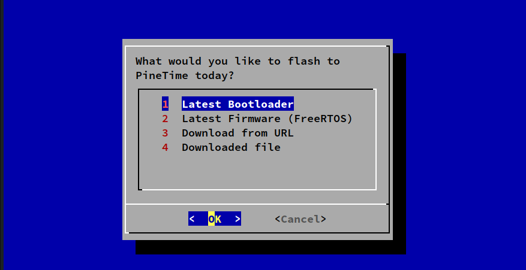

# pinetime-updater: Flash firmware to PineTime the friendly wired way with OpenOCD



-   Flash the [__Latest Bootloader (MCUBoot)__](https://lupyuen.github.io/pinetime-rust-mynewt/articles/mcuboot) and [__Firmware (InfiniTime based on FreeRTOS)__](https://github.com/JF002/Pinetime) to [__PineTime Smart Watch__](https://lupyuen.github.io/pinetime-rust-mynewt/articles/pinetime) the wired way

-   After the firmware has been flashed to PineTime via the SWD port, we may update the firmware wirelessly (over Bluetooth LE) with the [__nRF Connect__](https://www.nordicsemi.com/Software-and-tools/Development-Tools/nRF-Connect-for-mobile) mobile app

-   Installs [__xPack OpenOCD__](https://xpack.github.io/openocd/install/) automatically

-   Builds [__`openocd-spi`__](https://github.com/lupyuen/openocd-spi) on Raspberry Pi

-   Also works for flashing any device with an SWD port (like STM32 Blue Pill)

## Requirements

-   Linux or macOS, connected to PineTime with [ST-Link v2 Compatible](https://www.aliexpress.com/wholesale?catId=0&initiative_id=SB_20180924134644&SearchText=st-link+v2&switch_new_app=y)

    [Video of PineTime Updater on macOS](https://youtu.be/2p4EZqevVJQ)

-   Or Raspberry Pi with Raspberry Pi OS (32-bit), connected to PineTime via the SPI port...

    ["Connect PineTime to Raspberry Pi"](https://github.com/lupyuen/visual-embedded-rust/blob/master/README.md#connect-pinetime-to-raspberry-pi)

    [Video of PineTime Updater on Raspberry Pi](https://youtu.be/PZ5NW8q8Zok)

## How To Run

```bash
# For macOS Only: Install brew according to https://brew.sh/
/bin/bash -c "$(curl -fsSL https://raw.githubusercontent.com/Homebrew/install/master/install.sh)"

# For Raspberry Pi Only: Enable SPI port with raspi-config
# Select Interfacing Options → SPI → Yes
sudo raspi-config

# Download the bash and OpenOCD scripts
git clone https://github.com/lupyuen/pinetime-updater

# Run the bash script
cd pinetime-updater
./run.sh

```

We should see `Done!` when the flashing has completed.

(In case of problems, compare with the logs at the end of this doc)

## Remove Flash ROM Protection

The above steps will fail when PineTime has Flash ROM Protection enabled. 

All PineTime watches shipped before August 2020 will have Flash ROM Protection enabled.

To remove PineTime's Flash ROM Protection (with Raspberry Pi only)...

1. Power off our Raspberry Pi

1. Connect our Raspberry Pi with Raspberry Pi OS (32-bit) to PineTime via the SPI port...

    ["Connect PineTime to Raspberry Pi"](https://github.com/lupyuen/visual-embedded-rust/blob/master/README.md#connect-pinetime-to-raspberry-pi)

1. Power on our Raspberry Pi. Open the Terminal and enter...

    ```bash
    cd pinetime-updater
    ./scripts/flash-unprotect.sh
    ```

    We should see...

    ```
    Removing flash protection and erasing flash...
    Shut down and power off your Raspberry Pi. Wait 30 seconds then power on your Raspberry Pi. Run flash-unprotect.sh to check flash protection.
    ```

1.  Follow the instructions to power off the Raspberry Pi.

1.  After 30 seconds, power it on and enter...

    ```bash
    cd pinetime-updater
    ./scripts/flash-unprotect.sh
    ```

    We should see...

    ```
    Flash is already unprotected
    ```
    
1.  Follow the steps in the previous section to flash our PineTime

## Raspberry Pi Troubleshooting

(This section is for Raspberry Pi only)

If we see `Clock Speed` and nothing else after that…

```
Info : BCM2835 SPI SWD driver
Info : SWD only mode enabled
Info : clock speed 31200 kHz
Info : SWD DPIDR 0x2ba01477
```

Then the connection to the SWD Port is probably loose, please check the pins.

If we don't see this `DPIDR` number, or if we see a different `DPIDR` number...

```
SWD DPIDR 0x2ba01477
```

Then the connection to the SWD Port is most likely loose, please check the pins.

Also enter `sudo raspi-config` and confirm that the SPI port has been enabled.

## How It Works

See [`run.sh`](run.sh) for the flashing steps.

Once the latest MCUBoot Bootloader and InfiniTime Firmware have been flashed to PineTime, we will be able to update the firmware wirelessly with the nRF Connect mobile app like this...

["Download PineTime Firmware"](https://lupyuen.github.io/pinetime-rust-mynewt/articles/cloud#download-and-test-our-pinetime-firmware)

(Except we won't be downloading the firmware from GitHub Actions. We will have the official link soon.)

For more about PineTime...

["PineTime doesn't run Linux... But that's OK!"](https://lupyuen.github.io/pinetime-rust-mynewt/articles/pinetime)

## Sample Log for Raspberry Pi

```
----- Downloading https://github.com/lupyuen/pinetime-rust-mynewt/releases/download/v4.1.7/mynewt_nosemi.elf.bin to /tmp/mynewt_nosemi.elf.bin... (If it stops here, URL is invalid)
+ wget -q https://github.com/lupyuen/pinetime-rust-mynewt/releases/download/v4.1.7/mynewt_nosemi.elf.bin -O /tmp/mynewt_nosemi.elf.bin
+ '[' '!' -f /tmp/mynewt_nosemi.elf.bin ']'
+ set +x

----- Flashing /tmp/mynewt_nosemi.elf.bin to address 0x0...
+ openocd-spi/bin/openocd -c ' set filename "/tmp/mynewt_nosemi.elf.bin" ' -c ' set address  "0x0" ' -f scripts/swd-pi.ocd -f scripts/flash-program.ocd
Open On-Chip Debugger 0.10.0+dev-01130-g9d1b46f5 (2020-08-03-21:20)
Licensed under GNU GPL v2
For bug reports, read
        http://openocd.org/doc/doxygen/bugs.html
/tmp/mynewt_nosemi.elf.bin
0x0
Info : only one transport option; autoselect 'swd'
force hard breakpoints
Info : BCM2835 SPI SWD driver
Info : SWD only mode enabled
Info : clock speed 31200 kHz
Info : SWD DPIDR 0x2ba01477
Info : nrf52.cpu: hardware has 6 breakpoints, 4 watchpoints
Info : Listening on port 3333 for gdb connections
Stopping...
target halted due to debug-request, current mode: Thread 
xPSR: 0x61000000 pc: 0x000001ce msp: 0x2000ffd8

Flashing ROM...
target halted due to debug-request, current mode: Thread 
xPSR: 0x01000000 pc: 0x000000d8 msp: 0x20010000
Enabled ARM Semihosting to show debug output
** Programming Started **
Info : nRF52832-QFAA(build code: E1) 512kB Flash, 64kB RAM
Warn : Adding extra erase range, 0x000056d8 .. 0x00005fff
** Programming Finished **
** Verify Started **
** Verified OK **

Restarting...
target halted due to debug-request, current mode: Thread 
xPSR: 0x01000000 pc: 0x000000d8 msp: 0x20010000, semihosting
Enabled ARM Semihosting to show debug output
```

## Sample Log for ST-Link

```
----- Downloading https://github.com/lupyuen/pinetime-rust-mynewt/releases/download/v4.1.7/mynewt_nosemi.elf.bin to /tmp/mynewt_nosemi.elf.bin... (If it stops here, URL is invalid)
+ wget -q https://github.com/lupyuen/pinetime-rust-mynewt/releases/download/v4.1.7/mynewt_nosemi.elf.bin -O /tmp/mynewt_nosemi.elf.bin
+ '[' '!' -f /tmp/mynewt_nosemi.elf.bin ']'
+ set +x

----- Flashing /tmp/mynewt_nosemi.elf.bin to address 0x0...
+ xpack-openocd/bin/openocd -c ' set filename "/tmp/mynewt_nosemi.elf.bin" ' -c ' set address  "0x0" ' -f scripts/swd-stlink.ocd -f scripts/flash-program.ocd
xPack OpenOCD, x86_64 Open On-Chip Debugger 0.10.0+dev-00378-ge5be992df (2020-06-26-12:31)
Licensed under GNU GPL v2
For bug reports, read
        http://openocd.org/doc/doxygen/bugs.html
/tmp/mynewt_nosemi.elf.bin
0x0

nRF52 device has a CTRL-AP dedicated to recover the device from AP lock.
A high level adapter (like a ST-Link) you are currently using cannot access
the CTRL-AP so 'nrf52_recover' command will not work.
Do not enable UICR APPROTECT.

force hard breakpoints
Stopping...
target halted due to debug-request, current mode: Thread 
xPSR: 0x41000000 pc: 0x00000da0 msp: 0x2000ffa0

Flashing ROM...
target halted due to debug-request, current mode: Thread 
xPSR: 0x01000000 pc: 0x000000d8 msp: 0x20010000
Enabled ARM Semihosting to show debug output
** Programming Started **
** Programming Finished **
** Verify Started **
** Verified OK **

Restarting...
target halted due to debug-request, current mode: Thread 
xPSR: 0x01000000 pc: 0x000000d8 msp: 0x20010000, semihosting
Enabled ARM Semihosting to show debug output

**** Done!
```
